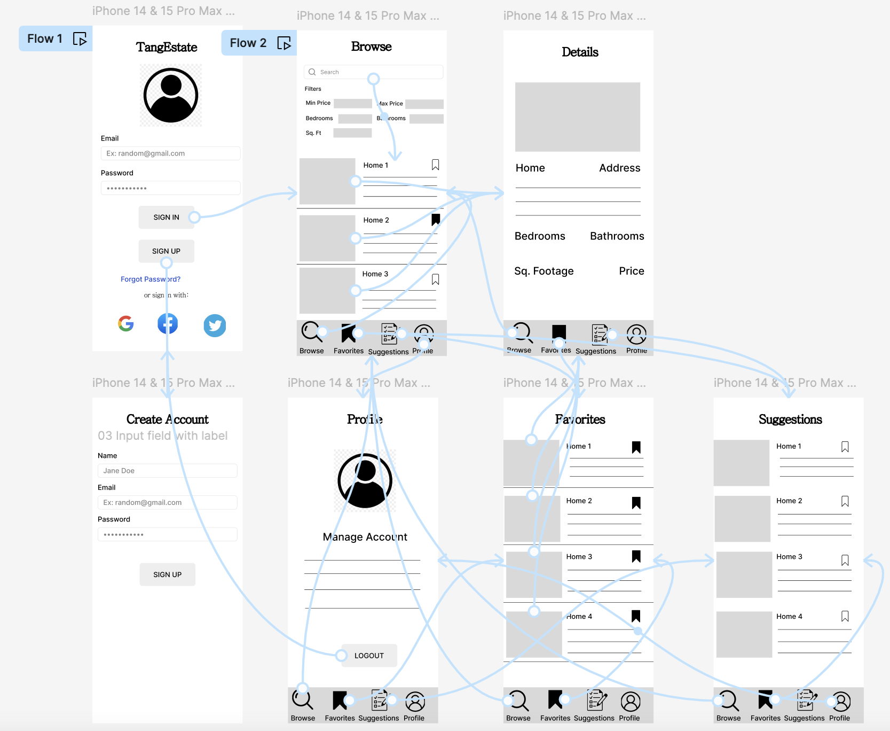
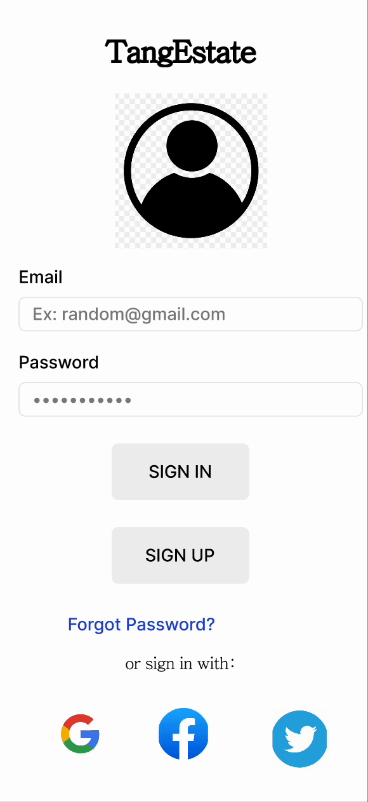

# Milestone 1 - PropertyPal

## Table of Contents

1. [Overview](#Overview)
1. [Product Spec](#Product-Spec)
1. [Navigation](#Navigation)

<!-- 

 -->
## Overview

### Description

PropertyPal is a mobile application designed for users to view and search for specific homes around their location. They can narrow down the homes they want to view using filters and can mark homes they like. The app allows the users to view the features of the home they click on as well and keeps a log of all the homes they've liked/pinned.
### App Evaluation

- **Category:** Real Estate
- **Mobile:** The app is optimized for mobile devices, providing users with the flexibility to search and view properties on the go. Its responsive design ensures seamless navigation and functionality, enhancing the user experience.
- **Story:** The app offers users the opportunity to explore a wide range of properties, from houses to apartments, utilizing an intuitive interface. Users can easily search for homes based on location, price range, number of bedrooms/bathrooms, and other customizable filters. Detailed listings provide comprehensive information about each property, including photos, descriptions, amenities, and contact details for agents or sellers. Users can also save favorite listings.
- **Market:** The real estate market is highly competitive and dynamic, with a growing number of consumers relying on digital platforms to search for properties. This app caters to the needs of both buyers and sellers, offering a convenient and efficient way to connect with potential properties or buyers. With the increasing reliance on mobile technology for everyday tasks, the app targets a broad demographic of users who prefer the convenience of accessing property listings anytime, anywhere.
- **Habit:** The app aims to become a go-to destination for individuals and families in their quest for finding their dream home or investment property. By providing a seamless and engaging user experience, the app encourages users to frequent the platform regularly. Features such as saved searches and personalized recommendations keep users actively engaged and informed about new opportunities in the market. The habit-forming nature of the app fosters long-term usage and establishes it as an indispensable tool in the real estate journey of its users.
- **Scope:** The app's comprehensive features whether it be property search or location tracking cater to the diverse needs of users, whether they are first-time homebuyers, seasoned investors, or sellers looking to showcase their properties. Additionally, potential expansions into additional markets or integration with emerging technologies could further broaden the app's scope and impact within the real estate industry.

## Product Spec

### 1. User Features (Required and Optional)

**Required Features**

- [x] Login and Signup Functionality: Users must sign in to access house info and past house data they have saved.
- [x] Search Houses: Search bar that allows users to search up houses around a specified location and narrow down their search using filters.
- [x] Liked Houses: Database that stores houses and house details the users have liked/pinned.
- [x] House Details: Displays the details of the house when the user clicks on a specific house they are interested in.
- [x] House Recommendations: Keeps track of liked houses statistics and provides house recommendations to the user based on these stats.

**Optional Features**

- [ ] AI Bot: incorporates an AI bot that provides feedback and advice to users who are house searching.
- [ ] Neighborhood Tracker: provides details about the surrounding neighborhood of the specified location including school details and restaurant information.

### 2. Screen Archetypes
- Login/Signup Screen 
    - [x] Required Story: Users can sign up or login to access the app.
- Browse Screen (Dashboard)
    - [x] Required Story: Users can search for houses around a specified location. They can refine their search using specific filters.
- Favorites Screen
    - [x] Required Story: Users can view the houses they've liked/pinned.
- Profile Screen
    - [ ] Required Story: Users can adjust their settings, manage their account, or log out.
- Details Screen
    - [x] Required Story: Users can view the details of the house, including the price, # of bedrooms and bathrooms, and the square footage.
 - Suggestions Screen
    - [x] Required Story: Keeps track of liked houses statistics and uses that data to provide house recommendations to the user.

### 3. Navigation

**Tab Navigation** (Tab to Screen)

* Favorites: Keeps a log of the all the houses the user liked/pinned.
* Browse: Allows users to search for homes around the location they specified and narrow down their search using filters.
* Profile: Takes users to their profile where they can view their account settings.
* Suggestions: Provides users with a recommended list of houses for them to check out.

**Flow Navigation** (Screen to Screen)

- Login Screen => Browse Screen (By Default) or Login Screen => Signup Screen
- Signup Screen => Browse Screen (By Default)
- Browse Screen <==> Details Screen
- Favorites Screen <==> Details Screen
- Suggestions Screen <==> Details Screen

### Digital Wireframe

 

### Interactive Prototype

 

# Milestone 2 - Build Sprint 1 (Unit 8)

## GitHub Project board

[Add screenshot of your Project Board with three milestones visible in
this section]

## Issue cards

- [Add screenshot of your Project Board with the issues that you've been working on for this unit's milestone] 
- [Add screenshot of your Project Board with the issues that you're working on in the **NEXT sprint**. It should include issues for next unit with assigned owners.] 

## Issues worked on this sprint

- Created all the activities, fragments, and XML diagrams. Finished setting up the login & signup page using Firebase. Finished the navigation toolbar and connected it to fragments. Implemented part of the lesson functionality.
- [Add giphy that shows current build progress for Milestone 2. Note: We will be looking for progression of work between Milestone 2 and 3. Make sure your giphys are not duplicated and clearly show the change from Sprint 1 to 2.]

 

# Milestone 3 - Build Sprint 2 (Unit 9)

## GitHub Project board

[Add screenshot of your Project Board with the updated status of issues for Milestone 3. Note that these should include the updated issues you worked on for this sprint and not be a duplicate of Milestone 2 Project board.] 

 

# Milestone 4 - Build Sprint 3 (Unit 9)

## GitHub Project board

[Add screenshot of your Project Board with the updated status of issues for Milestone 3. Note that these should include the updated issues you worked on for this sprint and not be a duplicate of Milestone 2 Project board.] 

## Completed user stories

### List the completed user stories from this unit
- Interactive Lessons with 5 levels
- User is able to choose from 3 languages to learn (Chinese, Spanish, and French)
- Beautify UI

### List any pending user stories / any user stories you decided to cut from the original requirements
- Implementing the Room Database (Pending)
- Settings account (In progress - Almost complete)
- Music Section (In porgress)
- Speaking Practice (Pending)

[Add video/gif of your current application that shows build progress]

## App Demo Video

- [Embed the YouTube/Vimeo link of your Completed Demo Day prep video](https://youtu.be/WH12_CAND_M)

## App Slide Deck
- [Language Learning Model Slide Deck](https://docs.google.com/presentation/d/1AusmJj8K6YlXrdg76N3g1gMdAmI7j8nsl3cwmX5SiEs/edit?usp=sharing)
